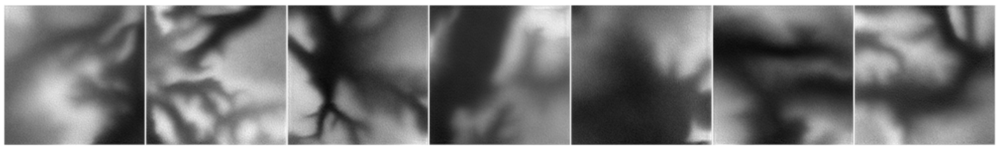

# Neural Terrain Generation
Neural Terrain Generation (NTG) is a collection of generative neural networks that output heightmaps for 3D terrain. This repository contains code for the entire NTG training pipeline.

[NTG Unity Trailer](https://youtu.be/MZakPuXyquk)

</img>

## Setup
After cloning, create a directory at the root of the repository called ``data``.

## Computing FID Stats
Before starting a training run, you must compute the FID stats for the dataset you are using. This is done by running: 
```
python fid --precompute --img_dir <PATH_TO_DATASET> --out_dir <PATH_TO_OUTPUT_DIRECTORY> --img_size <WIDTH> <HEIGHT>
```
Here's a specific example of this command:
```
python fid --precompute --img_dir ../heightmaps/world-heightmaps-01 --out_dir data/dataset_info --img_size 256 256
```
Note that fid is structured as a Python package, so you don't have to add the ``.py`` extension when running it.

Full list of paramaters:
- ``--path1``: Path to image directory or .npz file containing pre-computed statistics. Default: ``None``
- ``--path2``: Path to image directory or .npz file containing pre-computed statistics. Default: ``None``
- ``--batch_size``: Batch size per device for computing the Inception activations. Default: ``50``
- ``--img_size``: Resize images to this size. The format is (height, width). Default: ``None``, ``None``
- ``--precompute``: If True, pre-compute statistics for given image directory. Default: ``False``
- ``--img_dir``: Path to image directory for pre-computing statistics. Default: ``None``
- ``--out_dir``: Path where pre-computed statistics are stored. Default: ``None``
- ``--out_name``: Name of outputted statistics file. Default: ``stats``
- ``--mmap``: If True, use mmap to compute statistics. Helpful for large datasets. Default: ``True``
- ``--mmap_filename``: Name for mmap file. Only used if mmap is True. Default: ``data/temp/mmap_file``

## Models
- [pix](./models/pix.py): Vanilla implicit diffusion model (DDIM).
- [hyper](./models/hyper.py) Latent implicit diffusion model.
To train these models, simply run their corresponding python script. Currently, only pix is trainable. 

## Legacy Code
 The ``legacy`` directory contains all the NTG code that was originally implemented in Tensorflow. This code is no longer maintained, but is kept here for reference. In order to run it, use the Docker environment described by the ``legacy/Dockerfile`` and ``legacy/docker-compose.yaml`` files.

## Docker Environment

Building image:
```
docker-compose build
```

Starting container/environment:
```
docker-compose up -d
```

Opening a shell in container:
```
docker-compose exec ntg bash
```

Instead of opening a shell, you can also go to http://localhost:8888/ to access a Jupyter Lab instance running inside the container.

Stopping container/environment:
```
docker-compose down
```
